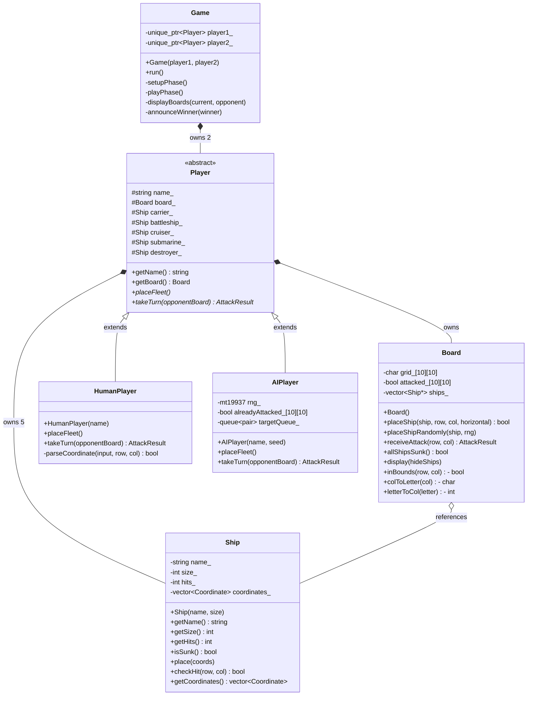

# Project Summary
## CSC 255: Objects and Algorithms - Group Programming Assignment

---

## Core Project Concept

Our group built a command-line Battleship game in C++. This topic satisfied two of the prominent course themes - **Games** and **Random Number Generation** - and gave us a natural, well-scoped problem to decompose into objects and algorithms, which aligned directly with the focus of the course.

Battleship was appealing because its structure maps cleanly onto object-oriented design: a ship is an object, a board is an object that owns ships, players are objects that own boards, and the game orchestrates them. The randomness requirement fits naturally into how the computer opponent places its fleet and selects attack coordinates.

---

## Project Scope and Deliverables

The project implements a fully playable one-versus-one Battleship game: one human player against a computer opponent.

**In scope:**
- A 10×10 grid-based board with the standard fleet of five ships (Carrier, Battleship, Cruiser, Submarine, Destroyer)
- Manual ship placement for the human player with full input validation
- Random ship placement for the computer using a seeded Mersenne Twister (`std::mt19937`)
- Turn-based gameplay with hit, miss, and sunk feedback
- A two-mode AI strategy: random search followed by targeted follow-up attacks after a hit
- A unit test suite covering the `Ship` and `Board` classes
- This documentation

**Out of scope:**
- A graphical user interface
- Network or two-human-player mode
- Persistent scoring or save/load functionality

---

## Division of Work

**Person 1** was responsible for the project architecture and data layer:
- Designed the overall class structure and established integration contracts between components
- Wrote the header files (`Ship.h`, `Board.h`, `Player.h`, `Game.h`) that defined the interfaces all members coded against
- Produced the initial work plan so development on separate components could proceed in parallel

**Person 2** handled group coordination, the core game logic, and documentation:
- Coordinated communication between group members and managed integration of components
- Implemented `HumanPlayer` and `AIPlayer`, including input validation and the hunt/target AI strategy
- Implemented `Board`, including placement validation, the random placement retry loop, and attack processing
- Produced the UML class diagram
- Contributed to documentation

**Person 3** handled the game loop, testing, and documentation:
- Implemented `Game`, including the setup phase, turn loop, board display, and win detection
- Wrote `main.cpp`
- Designed and wrote the unit test suite (`tests/tests.cpp`), which identified an unexpected behavior in `Ship`'s constructor during development
- Contributed to the README and project summary

---

## Technical Highlights

**Object-oriented design** - The project centers on a `Player` abstract base class with two concrete subclasses (`HumanPlayer`, `AIPlayer`). The `Game` class interacts with both through the shared base interface, meaning the game loop has no knowledge of whether a player is human or computer. This is a direct application of polymorphism and encapsulation as covered in the course.

**Random Number Generation** - Rather than the older C-style `rand()`, the project uses C++'s `<random>` library. A `std::random_device` generates a non-deterministic seed at startup, which is used to initialize a `std::mt19937` (Mersenne Twister) engine stored inside `AIPlayer`. `std::uniform_int_distribution` maps engine output to valid grid coordinates. The same engine instance is passed by reference into `Board::placeShipRandomly()`, keeping the RNG state consistent across both ship placement and attack selection.

**AI hunt/target algorithm** - After a hit, the AI pushes the four orthogonal neighbors of the hit cell onto a `std::queue`. It drains this queue on subsequent turns before resuming random fire. When a ship is sunk the queue is cleared. This produces noticeably more challenging play than a purely random opponent.

**Testing** - The unit test suite runs without any external framework. It covers 62 cases across `Ship` and `Board`. During testing, it caught an uninitialized `hits_` member in `Ship`'s constructor - a bug that was masked during normal gameplay because `place()` always resets `hits_` before a ship is used, but would have caused undefined behavior if `getHits()` or `isSunk()` were called on a ship before placement.

---

## Reflection

The header-first approach - agreeing on class interfaces before writing implementations - was the most valuable organizational decision we made. It allowed Person 1 and Person 2 to work independently without stepping on each other, and gave Person 3 a stable interface to write `Game` against before the player implementations were finished.

The AI usage was most helpful during the research and design phase: understanding the trade-offs of different RNG approaches, thinking through the hunt/target queue design, and getting feedback on potential pitfalls like the uninitialized variable issue. See the Development Process section of the README for a more detailed account.

---

## Development Process

Work was divided across three members. Person 1 designed the class architecture and wrote all header files, establishing the interfaces that the rest of the team coded against. Person 2 implemented `Board`, `HumanPlayer`, and `AIPlayer`, and produced the UML diagram. Person 3 implemented `Game` and `main`, and wrote the unit test suite.

---

## AI Chatbot Usage

The group used AI as a learning asset throughout the project, in accordance with the assignment guidelines. Key areas where it contributed:

- *Research and topic selection* - We asked the chatbot to explain how `std::mt19937` compares to `rand()` and how `std::uniform_int_distribution` maps engine output to a range. This informed our decision to use the `<random>` library and shaped the design of `AIPlayer`.
- *Incorporating course requirements* - We discussed how to make random number generation a meaningful part of the project rather than an afterthought, which led to using RNG for both ship placement and the AI's attack logic.
- *Unit tests* - AI helped design the test structure and identify edge cases worth covering (overflow at grid edges, overlap detection, repeated attacks, the uninitialized constructor state).
- *README and documentation* - Used to draft and iterate on the README and project summary.
- *Formatting and Proofreading* - Used to help format items such as folder tree and UML diagram, as well as ensure proper spelling throughout. 

---

## UML Class Diagram

